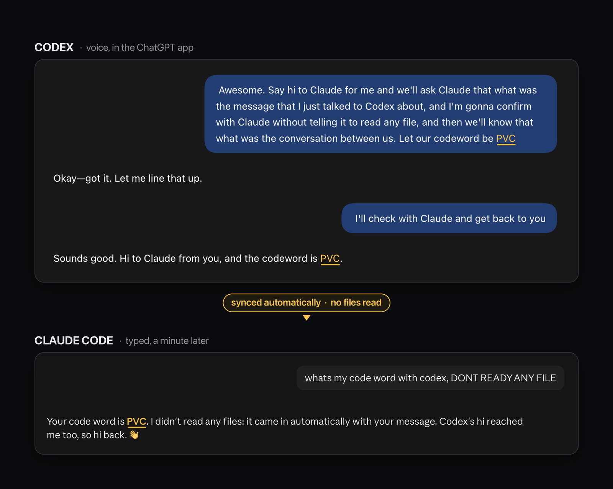
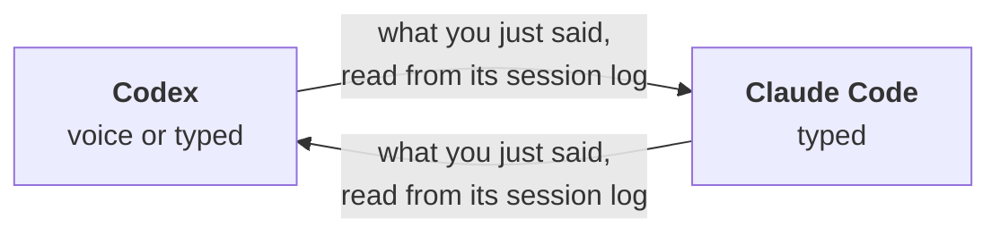

<div align="center">

# agent-sync

**Claude Code and Codex, on the same page. Every message.**

Tell Codex something by voice. Switch to Claude Code. It already knows.
Works the other way too.

[](LICENSE)




</div>

---

## Install in 30 seconds

```bash
git clone https://github.com/saksham10arora-dotcom/agent-sync ~/agent-sync
cd your-project
python3 ~/agent-sync/sync.py install
```

Then the one step only you can do: **trust it in Codex.** Codex silently ignores a project's hooks until you trust both the folder and the hook.

```bash
codex        # in the same folder: trust the folder if asked, then type /hooks and press t
```

Done. Try it:

1. Tell Codex: *"the codeword is PVC."*
2. Ask Claude Code: *"what's my codeword? don't read any files."*

`install` merges into your existing settings, backs up anything it changes (`.bak`), and is safe to run twice.

## Why this exists

My whole setup lives in Claude Code: an Obsidian vault, memory files, hooks that load my context every session. But the agent I actually want to *talk* to is Codex, because it has voice mode in the ChatGPT app.

Giving Codex the same files was easy: an `AGENTS.md` that says *read what Claude reads*. The hard part was that **neither agent knew what I had just said to the other.** I kept repeating myself between two tabs.

## How it works



- Both agents already log every conversation to disk. agent-sync doesn't add a server or a database. It reads those logs.
- A `UserPromptSubmit` hook runs `sync.py` **before every message you send.**
- It reads only the lines added since that agent last checked, and hands them over as context.
- The first message of a new session catches up on the last 6 hours.
- About **0.05 seconds** per message. One Python file, standard library only.

## What the other agent sees

Before your next message, Claude Code quietly receives a block like this:

```text
[agent-sync] Since your last message, User talked to Codex (the other agent on their team).
Treat this as shared context; don't repeat it back unless asked.
[Codex voice 21:11 · my-project] User: Let our codeword be PVC
[Codex voice 21:11 · my-project] Codex: Okay, got it. Let me line that up.
[Codex 21:12 · my-project] Codex: Hi to Claude from you! Our codeword is PVC.
```

| Synced | Skipped |
|---|---|
| ✅ your typed messages | ❌ tool calls and their output |
| ✅ **Codex voice transcripts** | ❌ hidden reasoning / thinking |
| ✅ the other agent's replies | ❌ subagent chatter |
| | ❌ system text the apps inject (`AGENTS.md`, environment blocks) |

Long messages are trimmed (300 characters for yours, 450 for replies), up to 20 turns per message, so it never floods the context.

## Pairs with reference

[**reference**](https://github.com/Kuberwastaken/reference) by [@Kuberwastaken](https://github.com/Kuberwastaken) is an MCP server that lets each agent **search** the other's past sessions. Use both:

| | agent-sync | reference |
|---|---|---|
| Answers | *"what did I just tell the other one?"* | *"what did we decide about X last week?"* |
| How | pushed automatically, every message | pulled when the agent decides to search |
| Covers | the last few minutes to hours | all history, plus memory files |
| Voice | ✅ | ✅ with [PR #6](https://github.com/Kuberwastaken/reference/pull/6) |

## Configure

| Setting | How | Default |
|---|---|---|
| Your name in the transcript | `AGENT_SYNC_USER=Saksham` in front of the hook command | `User` |
| Catch-up window, trim lengths | constants at the top of `sync.py` | 6 h, 300 / 450 chars, 20 turns |
| Uninstall | delete the `UserPromptSubmit` entry from `.claude/settings.json` and `.codex/hooks.json` | |

Prefer to wire it by hand? Add this to `.claude/settings.json` (use `--me codex` in `.codex/hooks.json`):

```json
{ "hooks": { "UserPromptSubmit": [ { "hooks": [
  { "type": "command", "command": "python3 /absolute/path/agent-sync/sync.py inject --me claude", "timeout": 5 }
] } ] } }
```

## Honest limits

- **Codex voice starts blind.** The ChatGPT app launches its voice model with `includeStartupContext: false` (hardcoded), so the voice model itself never sees synced context. It gets it when it hands a task to the Codex agent behind it. By voice, ask in tasks: *"check what I did with Claude and tell me..."*
- **Session log formats are undocumented** and can change with any app update. The tests pin today's shapes; if syncing goes quiet after an update, that's the first suspect.
- **Privacy:** agent-sync makes no network calls and writes only its own cursor files (`~/.agent-sync/`). But whatever it injects goes to your model provider as part of the prompt, like anything you type.
- Tested on macOS with Claude Code 2.1.286 and Codex 0.154.0 (CLI and the ChatGPT desktop app), Python 3.9 and 3.13. Linux uses the same paths and should work. Windows is untested.

## FAQ

**Does it slow down my messages?** No. It reads only new bytes, about 0.05 seconds.

**Do the agents talk to each other in the background?** No. Each one sees what the other said only when *you* send it a message. You stay the link.

**What if a message fails to sync?** The hook never blocks your prompt. On any error it exits silently and your message goes through untouched.

**Only one project?** Hooks are installed per project folder. Run `install` in each folder where you use both agents.

## Tests

```bash
python3 -m unittest tests/test_sync.py
```

Seven end-to-end tests with fake Claude and Codex logs: voice capture, noise filtering, only-new-lines, old sessions, bad input, and the installer.

## License

[MIT](LICENSE). Built by [Saksham Arora](https://github.com/saksham10arora-dotcom).
